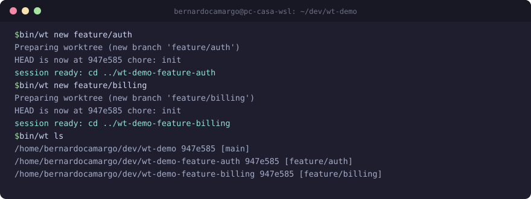
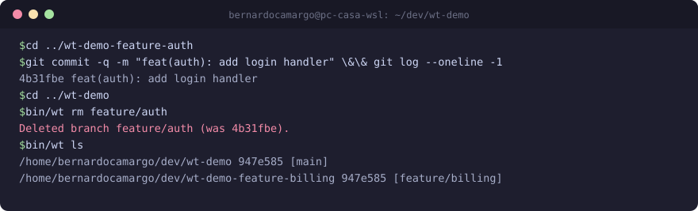

# `wt` — worktree helper for parallel agent sessions

`bin/wt` is a ~40-line bash wrapper around `git worktree` that makes the
[parallel-sessions strategy](../worktrees/README.md) one command per step:
spin up an isolated worktree + branch for an agent session, list what's
running, and clean up after merge.

**Requirements:** git ≥ 2.5 and bash. No dependencies. Run it from anywhere
inside the repo — it derives everything from the current checkout.

## Commands

| Command | What it does |
|---|---|
| `bin/wt new <branch>` | Creates a worktree at `../<repo>-<branch>` on a new branch (slashes in branch names become `-` in the directory name) and prints the session path |
| `bin/wt ls` | Lists every worktree with its branch and HEAD |
| `bin/wt rm <branch>` | Removes that worktree **and its local branch** — run after the PR merged |

Anything else (`wt`, `wt new` with no branch, unknown commands) prints usage
and exits non-zero, so scripts and agents fail loudly instead of guessing.

## Seeing is believing

The transcript below is a real run: two sessions spun up in parallel, work
committed inside one, then cleanup — with `wt ls` showing exactly which
sessions exist at every step.

### 1. Spin up two parallel sessions

### 2. Work happens inside a session, then it's removed

## Design notes

- **Worktrees live outside the repo** (`../`), so the main checkout is never
  disturbed and each session directory is a fully independent agent workspace.
- **The printed path is the handoff.** `wt new` ends with `session ready: cd
  ../…` — that line is what you paste into a new agent chat, or use as the
  dispatch target when coordinating waves
  ([`agent-waves`](../skills/agent-waves/SKILL.md)).
- **`rm` removes the branch too.** After a PR merges, the branch's purpose is
  served; keeping it around invites stale-work confusion. The deletion is
  confirmed in the output so nothing disappears silently.
- **Path flattening:** `feature/auth` becomes `../<repo>-feature-auth` —
  slashes are for git, not for your filesystem.

For when *not* to parallelize and how to order merges, read
[`worktrees/README.md`](../worktrees/README.md).
